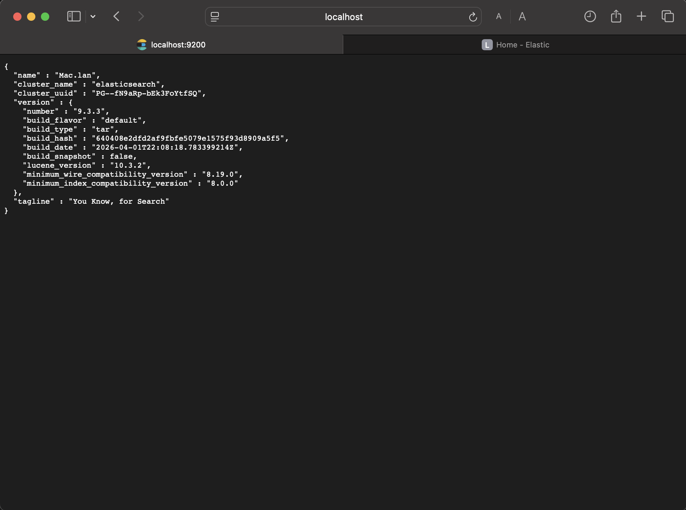
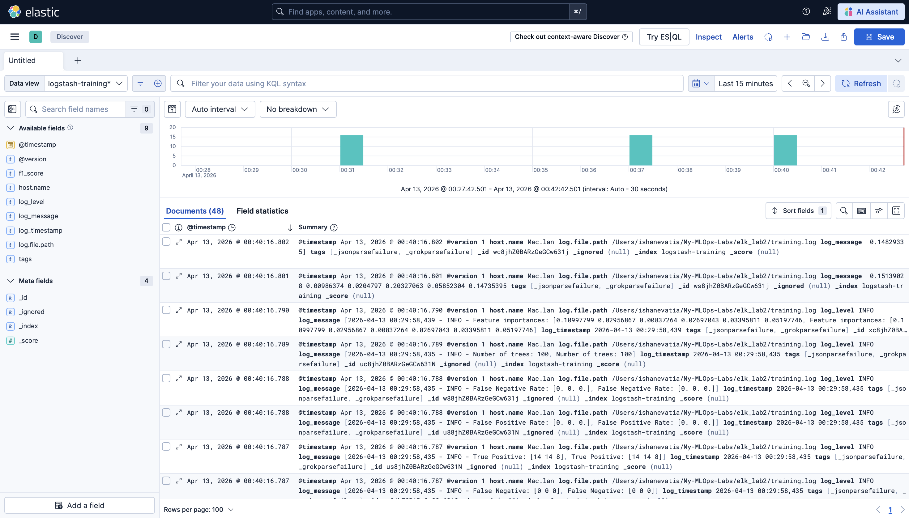

# ELK Stack ML Monitoring Lab

A machine learning pipeline that trains a Random Forest classifier on the Wine dataset, logs training metrics, and visualizes them using the ELK Stack (Elasticsearch, Logstash, Kibana).

---

## Stack

- **Python 3.13** with scikit-learn
- **Elasticsearch 9.3.3** — stores structured log data
- **Logstash 9.3.3** — ingests and parses training logs
- **Kibana 9.3.3** — visualizes logs in the Discover dashboard

---

## Project Structure

```
elk_lab2/
├── train_model.py       # ML training script
├── logstash.conf        # Logstash pipeline configuration
├── training.log         # Generated by train_model.py
└── README.md
```

---

## Setup Instructions

### 1. Python Environment

Create and activate a virtual environment, then install dependencies:

```bash
/opt/homebrew/bin/python3.13 -m venv venv
source venv/bin/activate
pip install scikit-learn
```

---

### 2. Start Elasticsearch

```bash
cd /path/to/elasticsearch
bin/elasticsearch
```

Verify it is running by visiting: `http://localhost:9200`

You should see a JSON response with cluster information.


*Elasticsearch cluster confirmed running*

---

### 3. Start Kibana

```bash
cd /path/to/kibana
bin/kibana
```

Verify it is running by visiting: `http://localhost:5601`


*Kibana dashboard on startup*

---

### 4. Run the Training Script

With the virtual environment activated:

```bash
cd /path/to/elk_lab2
source venv/bin/activate
python train_model.py
```

This generates `training.log` containing all model metrics.

---

### 5. Configure Logstash

Create a `logstash.conf` file in your project directory with the following content:

```
input {
  file {
    path => "/path/to/elk_lab2/training.log"
    start_position => "beginning"
    sincedb_path => "/dev/null"
  }
}

filter {
  grok {
    match => { "message" => "%{TIMESTAMP_ISO8601:timestamp} - %{LOGLEVEL:level} - %{GREEDYDATA:log_message}" }
  }
}

output {
  elasticsearch {
    hosts => ["http://localhost:9200"]
    index => "logstash-training"
  }
  stdout {
    codec => rubydebug {
      metadata => false
    }
  }
}
```

Replace `/path/to/elk_lab2/` with the absolute path to your project folder.

---

### 6. Start Logstash

```bash
cd /path/to/logstash
bin/logstash -f /path/to/elk_lab2/logstash.conf
```

Logstash will read `training.log`, parse each line using the grok filter, and forward the structured data to Elasticsearch under the `logstash-training` index.

Verify the data was indexed:

```
http://localhost:9200/logstash-training/_count
```

A successful response looks like: `{"count": 32, ...}`

---

### 7. Visualize in Kibana

1. Open `http://localhost:5601`
2. Go to **Stack Management** → **Data Views** → **Create data view**
3. Set the index pattern to `logstash-training*`
4. Set the timestamp field to `@timestamp`
5. Save the data view
6. Navigate to **Analytics** → **Discover**
7. Select the `logstash-training*` data view from the dropdown in the top left
8. Adjust the time filter (top right) to **Today** or **Last 24 hours** if no results appear


*ML training metrics visualized in Kibana Discover under the logstash-training* data view*

---

## Model Details

| Setting | Value |
|---|---|
| Dataset | Wine (sklearn built-in, 178 samples, 13 features, 3 classes) |
| Model | Random Forest Classifier |
| Train/Test Split | 80% / 20% (random_state=42) |
| Training Samples | 142 |
| Testing Samples | 36 |

## Results

| Metric | Value |
|---|---|
| Accuracy | 1.00 |
| F1 Score (weighted) | 1.00 |
| True Positives | [14, 14, 8] |
| True Negatives | [22, 22, 28] |
| False Positives | [0, 0, 0] |
| False Negatives | [0, 0, 0] |
| False Positive Rate | [0, 0, 0] |
| False Negative Rate | [0, 0, 0] |

## Logged Parameters

- Number of trees: 100
- Feature importances across all 13 wine features

---

## Changes from Original Script

The original lab script used the Iris dataset with a Logistic Regression model. The following changes were made:

**Dataset** — Switched from `load_iris` to `load_wine`. The Wine dataset has 178 samples across 3 classes and 13 features (compared to Iris's 4), making it a slightly more complex classification task.

**Model** — Replaced `LogisticRegression` with `RandomForestClassifier` from `sklearn.ensemble`. Random Forest is an ensemble method that builds multiple decision trees and merges their results, which generally produces more robust predictions than a single linear model.

**Logged parameters** — Since Random Forest does not have coefficients or an intercept, the final logging lines were updated to log `n_estimators` (number of trees, default 100) and `feature_importances_` (the relative contribution of each of the 13 features to the model's predictions) instead.