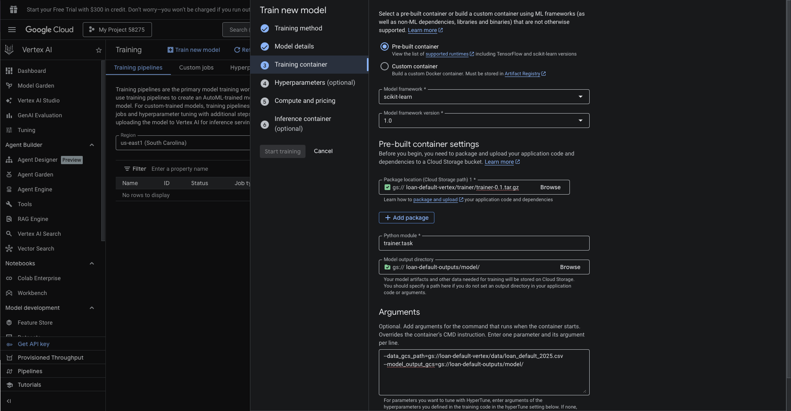
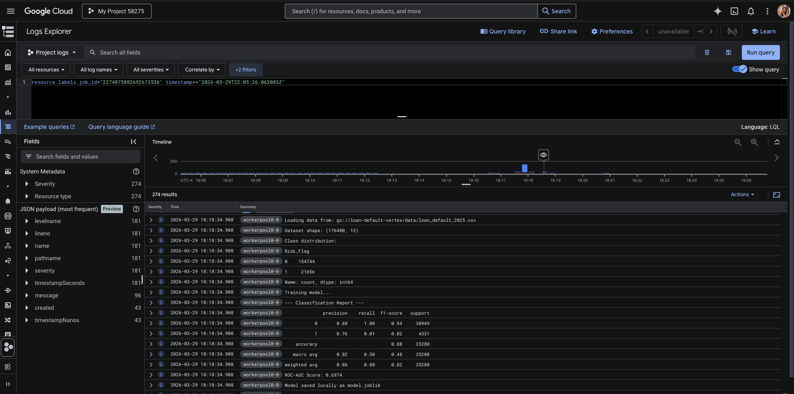
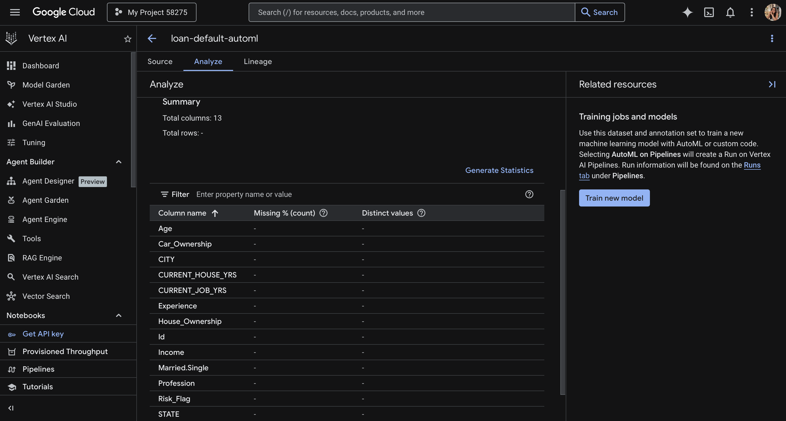
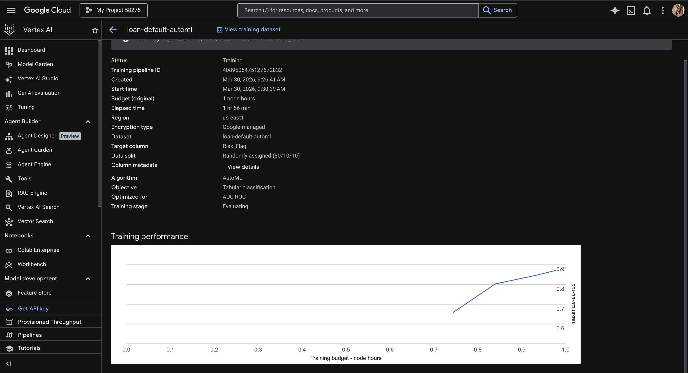
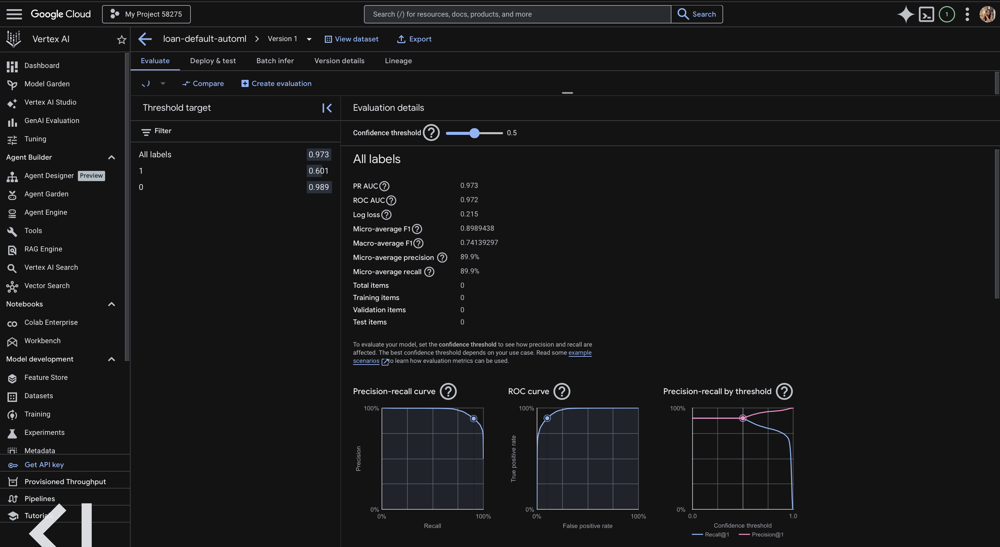
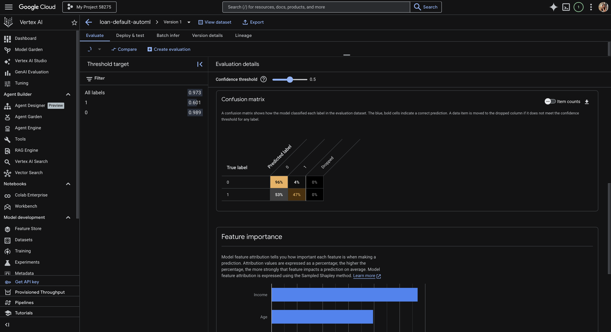
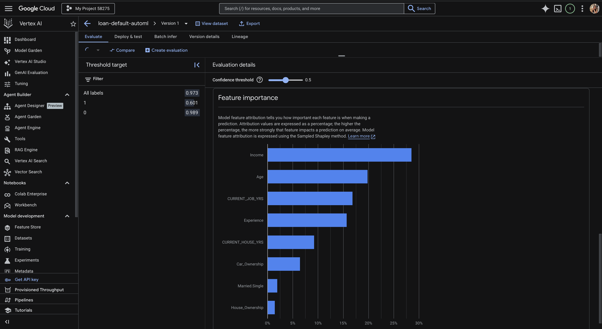
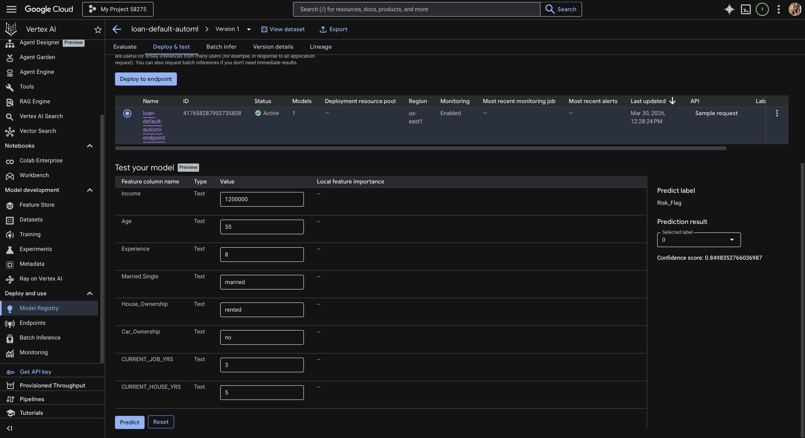

# Loan Default Prediction on Vertex AI
A comparison of two Vertex AI training approaches — AutoML and Custom Pre-built Container — applied to a real-world financial risk dataset to predict whether a borrower will default on a loan.

---

## 📌 Project Overview

This project demonstrates two distinct ways to build and deploy machine learning models using Google Cloud's Vertex AI platform:

| Approach | Method | Dataset | Target |
|---|---|---|---|
| Part 1 | AutoML (no-code) | Loan Default 2025 | `Risk_Flag` |
| Part 2 | Custom Model + Pre-built Container | Loan Default 2025 | `Risk_Flag` |

By using the **same dataset for both approaches**, we can directly compare AutoML's automated pipeline against a hand-crafted Gradient Boosting model — highlighting trade-offs in control, performance, and effort.

---

## 📂 Repository Structure

```
gcp_vertex/
├── AutoML/
│   └── loan_default_2025.csv          ← Dataset used for AutoML training
│
└── Custom_Container/
    ├── trainer/
    │   ├── __init__.py                ← Makes trainer a Python package
    │   └── task.py                    ← Custom training script
    ├── setup.py                       ← Package config for source distribution
    ├── loan_default_2025.csv          ← Local copy of dataset
    └── dist/
        └── trainer-0.1.tar.gz         ← Packaged trainer (uploaded to GCS)
```

---

## 📊 Dataset

**Source:** [Loan Default Prediction Challenge 2025 — Kaggle](https://www.kaggle.com/competitions/predict-loan-default/data)

| Property | Value |
|---|---|
| Rows | 176,400 |
| Features | 12 |
| Target | `Risk_Flag` (0 = no default, 1 = default) |
| Class distribution | 154,744 (no default) / 21,656 (default) |

**Features used:**

| Column | Type | Notes |
|---|---|---|
| `Income` | Numeric | Annual income |
| `Age` | Numeric | Borrower age |
| `Experience` | Numeric | Years of work experience |
| `Married.Single` | Categorical | Marital status |
| `House_Ownership` | Categorical | Rented / owned / norent_noown |
| `Car_Ownership` | Categorical | Yes / No |
| `CURRENT_JOB_YRS` | Numeric | Years at current job |
| `CURRENT_HOUSE_YRS` | Numeric | Years at current residence |

**Dropped columns:** `Id` (identifier), `CITY`, `STATE`, `Profession` (too high cardinality)

---

## ☁️ GCS Bucket Structure

```
gs://loan-default-vertex/
├── data/
│   └── loan_default_2025.csv         ← Training data
└── trainer/
    └── trainer-0.1.tar.gz            ← Packaged custom training code

gs://loan-default-outputs/
└── model/
    └── model.joblib                  ← Trained custom model artifact
```

---

## 🔧 Prerequisites

- Python 3.10+
- Google Cloud SDK (`gcloud`)
- A GCP project with Vertex AI API enabled
- Kaggle account (to download dataset)

### Install Google Cloud SDK (Mac)
```bash
brew install --cask google-cloud-sdk
```

### Authenticate and set project
```bash
gcloud init
gcloud auth login
gcloud config set project YOUR_PROJECT_ID
```

### Create GCS Buckets
```bash
gcloud storage buckets create gs://loan-default-vertex --location=us-central1
gcloud storage buckets create gs://loan-default-outputs --location=us-central1
```

### Upload data and trainer package
```bash
gcloud storage cp AutoML/loan_default_2025.csv gs://loan-default-vertex/data/loan_default_2025.csv
gcloud storage cp Custom_Container/dist/trainer-0.1.tar.gz gs://loan-default-vertex/trainer/trainer-0.1.tar.gz
```

---

## Part 2: Custom Model + Pre-built Container

### Model Architecture

A `scikit-learn` Pipeline consisting of:
1. `StandardScaler` — normalizes numeric features
2. `GradientBoostingClassifier` — ensemble model with 100 estimators, learning rate 0.1, max depth 4

Categorical features (`Married.Single`, `House_Ownership`, `Car_Ownership`) are one-hot encoded via `pd.get_dummies` before training. Train/test split is stratified (80/20) to handle class imbalance.

### Package the Trainer

```bash
cd Custom_Container
python3 setup.py sdist --formats=gztar
```

This creates `dist/trainer-0.1.tar.gz` — the source distribution that Vertex AI will run.

### Create Training Job in Vertex AI

Go to **Vertex AI → Training → Create**

| Setting | Value |
|---|---|
| Dataset | No managed dataset |
| Method | Custom training |
| Framework | scikit-learn 1.0 |
| Package location | `gs://loan-default-vertex/trainer/trainer-0.1.tar.gz` |
| Python module | `trainer.task` |
| Model output | `gs://loan-default-outputs/model/` |
| Machine type | n1-standard-4 |
| Arguments | `--data_gcs_path=gs://loan-default-vertex/data/loan_default_2025.csv` `--model_output_gcs=gs://loan-default-outputs/model/` |




### Training Results




| Metric | Value |
|---|---|
| Accuracy | 88% |
| ROC-AUC | 0.6974 |
| Precision (default class) | 0.76 |
| Recall (default class) | 0.01 |
| Weighted F1 | 0.82 |

> ⚠️ **Note on class imbalance:** The dataset has a significant imbalance (87.7% non-default vs 12.3% default), which causes the model to under-predict defaults. A next iteration would address this using `class_weight='balanced'` or SMOTE oversampling.

### Register Model in Vertex AI

Go to **Vertex AI → Model Registry → Import**

| Setting | Value |
|---|---|
| Name | `loan-default-custom` |
| Region | `us-east1` |
| Framework | scikit-learn 1.0 |
| Artifact location | `gs://loan-default-outputs/model/` |


---

## Part 1: AutoML

### Create Dataset in Vertex AI

Go to **Vertex AI → Datasets → Create Dataset**

| Setting | Value |
|---|---|
| Name | `loan-default-automl` |
| Type | Tabular — Classification |
| Region | `us-east1` |
| Import source | `gs://loan-default-vertex/data/loan_default_2025.csv` |



### Train with AutoML

Go to **Vertex AI → Training → Create**

| Setting | Value |
|---|---|
| Dataset | `loan-default-automl` |
| Objective | Classification |
| Method | AutoML |
| Target column | `Risk_Flag` |
| Optimization metric | AUC ROC |
| Budget | 1 node hour |
| Early stopping | Enabled |



### AutoML Evaluation

> **📸 Screenshot: AutoML Evaluate tab — metrics table**
> `assets/screenshots/automl_evaluate_metrics.png`







| Metric | Value |
|---|---|
| **PR AUC** | 0.973 |
| **ROC AUC** | 0.972 |
| **F1 Score** | 0.90 |
| **Precision** | 89.5% |
| **Recall** | 90.44% |
| **Log Loss** | 0.215 |

**Confusion Matrix (at 0.5 threshold):**
- Non-default (0): 96% correctly classified, 4% false positives
- Default (1): 47% correctly classified, 53% missed

**Top Features by Importance (Shapley values):**
1. `Income` (~30%)
2. `Age` (~22%)
3. `CURRENT_JOB_YRS` (~20%)
4. `Experience` (~18%)
5. `CURRENT_HOUSE_YRS` (~8%)


### Deployed Test Predictions



---

## 🔁 AutoML vs Custom Model — Comparison

| | AutoML | Custom (GBM) |
|---|---|---|
| **Code required** | None | ~80 lines |
| **Training time** | ~60 min | ~15 min |
| **Control** | Low | High |
| **ROC-AUC** | 0.972 | 0.6974 |
| **Cost** | Higher | ~$0.10 |
| **Best for** | Quick baselines | Production pipelines |

---

## 🚀 Future Improvements

- Address class imbalance using `class_weight='balanced'` or SMOTE
- Hyperparameter tuning via Vertex AI HyperparameterTuning
- Add feature importance visualization
- Wrap endpoint in a Flask/FastAPI REST service
- Add CI/CD pipeline for model retraining

---

## 📚 References

- [Vertex AI Documentation](https://cloud.google.com/vertex-ai/docs)
- [Dataset: Loan Default Prediction Challenge 2025](https://www.kaggle.com/competitions/predict-loan-default)
- [Pre-built containers for prediction](https://cloud.google.com/vertex-ai/docs/predictions/pre-built-containers)